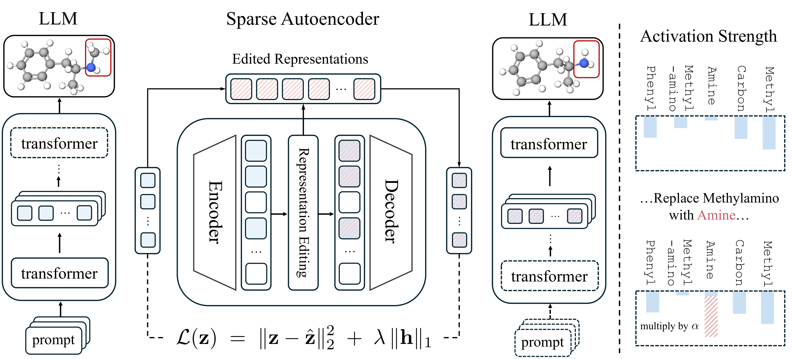

# SpaRE: Controllable Molecule Generation via Sparse Representation Editing



Official code for:

> Controllable Molecule Generation via Sparse Representation Editing: An Interpretability-Driven Perspective (ICML 2026)
> OpenReview: https://openreview.net/forum?id=ryO12fv5bJ

Our demo is available at [](https://spare-paper.github.io/)

This repository contains the entire SpaRE workflow. The code is organized around text-to-molecule data such as ChEBI-20, where `text`  is the natural-language prompt and `group_selfies` is the target
molecular sequence. Specifically, we open-source the following code:

1. Fine-tune a molecular language model on Group SELFIES text.
2. Collect transformer activations from selected layers.
3. Train sparse autoencoders (SAEs) over activations.
4. Extract local atom or functional-group control vectors.
5. Extract global property control vectors.
6. Run controllable molecule generation through sparse representation editing.

## Repository Scope

Included:

- The six public workflow scripts in `scripts/`.
- Inference-time activation editing implementation.
- SAE architecture and training loop.
- Concept extraction utilities.
- Documentation mapping paper claims to code paths.

Supplied or generated locally by the training scripts:

- Foundation model weights.
- Fine-tuned model weights.
- SAE weights.
- Precomputed concept vectors.
- LLM activations.
- Private datasets or benchmark splits not already redistributable.
- Generated proprietary molecule candidates.

Generated artifacts are excluded by `.gitignore`.

## Install

Use Python `3.10` through `3.13`. The PyTorch and Transformers stack may not
support newer Python releases immediately.

```bash
python -m pip install -e .
```

To install the upstream Group SELFIES package alongside this repository for
dataset preparation workflows:

```bash
python -m pip install -e ".[groupselfies]"
```

For development and tests:

```bash
python -m pip install -e ".[dev]"
pytest -q
```

## Expected Data

The training pipeline expects paired text-to-molecule records. For ChEBI-20
style data, use `text` as the natural-language prompt and `group_selfies` as
the converted molecule target:

```json
{"text": "A small polar alcohol used as a solvent.", "group_selfies": "[C][O]"}
```

CSV, JSONL, TXT, and JSON list files are supported. If your raw data is SMILES,
convert it to Group SELFIES before fine-tuning; this release does not include a
data-conversion command or a standard SELFIES encoder.

During fine-tuning, SpaRE scans all Group SELFIES bracket tokens in the target
column, such as `[C]`, `[=O]`, `[Branch1]`, or any other `[...]` group, and
adds missing tokens to the Hugging Face tokenizer before resizing the model
embeddings. Activation collection, concept extraction, and generation validate
against the tokenizer and fail fast if a requested Group SELFIES token is
missing.

The upstream Group SELFIES project is Apache-2.0 licensed and is acknowledged
in [ACKNOWLEDGEMENTS.md](ACKNOWLEDGEMENTS.md), [NOTICE](NOTICE), and
[docs/third_party.md](docs/third_party.md).

## Public Scripts

The released public scripts are:

- `scripts/finetune.sh`
- `scripts/collect_activations.sh`
- `scripts/train_sae.sh`
- `scripts/extract_local_vector.sh`
- `scripts/extract_global_vector.sh`
- `scripts/controlled_generate.sh`

They wrap the six public CLI commands exposed by `spare --help`.

## Pipeline

Fine-tune a base molecular LM:

```bash
spare finetune \
  --model path-or-hf-id \
  --data data/public/train.jsonl \
  --prompt-column text \
  --target-column group_selfies \
  --output artifacts/finetuned-lm \
  --epochs 2 \
  --batch-size 64 \
  --lr 5e-5 \
  --max-length 1024
```

Collect activations for SAE training:

```bash
spare collect-activations \
  --model artifacts/finetuned-lm \
  --data data/public/train.jsonl \
  --prompt-column text \
  --target-column group_selfies \
  --layers 10 22 \
  --output artifacts/activation_shards \
  --selector all \
  --batch-size 4 \
  --max-length 1024
```

Train an SAE for a layer:

```bash
spare train-sae \
  --activations artifacts/activation_shards/layer_10 \
  --output artifacts/sae_layer_10.pt \
  --expansion-factor 40 \
  --epochs 8 \
  --batch-size 1024 \
  --lr 1e-4 \
  --l1 1e-5
```

Extract a global property concept from positive and negative activation sets:

```bash
spare extract-global \
  --sae artifacts/sae_layer_10.pt \
  --positive-activations artifacts/soluble_pos/layer_10 \
  --negative-activations artifacts/soluble_neg/layer_10 \
  --name solubility \
  --layer 10 \
  --output artifacts/concepts/solubility.pt
```

Extract a local token concept:

```bash
spare extract-local \
  --sae artifacts/sae_layer_22.pt \
  --tokenizer artifacts/finetuned-lm \
  --token "[C]" \
  --activations artifacts/local_carbon/layer_22 \
  --name carbon \
  --layer 22 \
  --output artifacts/concepts/carbon.pt
```

Generate with representation editing:

```bash
spare generate \
  --model artifacts/finetuned-lm \
  --prompt "A small polar alcohol used as a solvent." \
  --concept artifacts/concepts/solubility.pt \
  --strength 0.8 \
  --max-new-tokens 128
```

For local atom or functional-group control, pass a local concept vector and
`--local-step` so the edit is applied only at the intended generation step.

## Reproducing Paper-Style Runs

The repository provides the full software path. A paper-style run has four
phases:

1. Prepare public or licensed text-to-molecule data with `text` prompts and
   Group SELFIES targets.
2. Fine-tune a Hugging Face causal LM using `spare finetune`.
3. Collect layer activations and train layer-specific SAEs.
4. Extract concept vectors from user-defined exemplar sets and run edited
   inference.

See [docs/reproducibility.md](docs/reproducibility.md) for the exact command
sequence and artifact layout.

For reviewer-facing checks that do not require private artifacts, see
[docs/artifact_evaluation.md](docs/artifact_evaluation.md).

## Paper-To-Code Map

- Section 3.1: `spare_molgen.sae.SparseAutoencoder`
- Section 3.2, local control: `spare_molgen.concepts.build_local_concept`
  and `spare_molgen.hooks.ActivationEditor`
- Section 3.2, global control: `spare_molgen.concepts.build_global_concept`
  and `spare_molgen.generation.generate_with_edits`
- Appendix C: `spare finetune`, `spare collect-activations`,
  `spare train-sae`, `spare extract-local`, `spare extract-global`,
  and `spare generate`

## Notes

This implementation is intentionally model-agnostic and uses Hugging Face
causal language models. Layer discovery supports common GPT-style,
LLaMA-style, GPT-NeoX-style, and encoder-decoder decoder stacks. For another
architecture, pass `--layer-path` to commands that access transformer blocks.

## Training Checkpoints

Use the scripts in [scripts/](scripts/) to run the released workflow:

```bash
bash scripts/finetune.sh
bash scripts/collect_activations.sh
bash scripts/train_sae.sh
bash scripts/extract_local_vector.sh
bash scripts/extract_global_vector.sh
bash scripts/controlled_generate.sh
```

The outputs are written under `artifacts/`, which is ignored by git.

## Citation

```bibtex
@inproceedings{
li2026controllable,
title={Controllable Molecule Generation via Sparse Representation Editing: An Interpretability-Driven Perspective},
author={Zhuoran Li, Xu Sun, Wanyu Lin, Chang Wen Chen},
booktitle={Forty-third International Conference on Machine Learning},
year={2026},
url={https://openreview.net/forum?id=ryO12fv5bJ}
}
```
